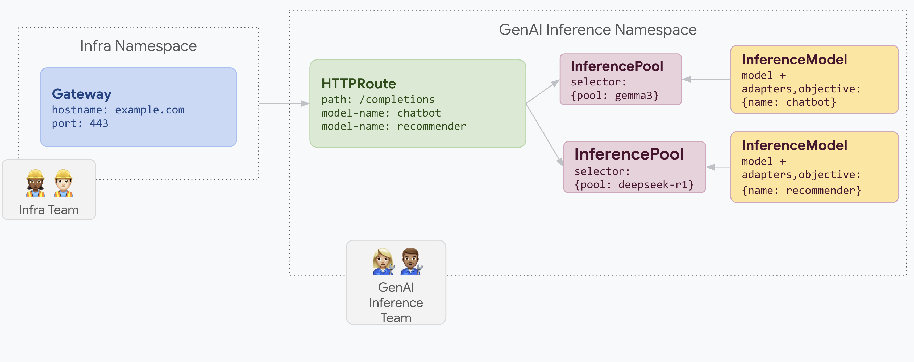
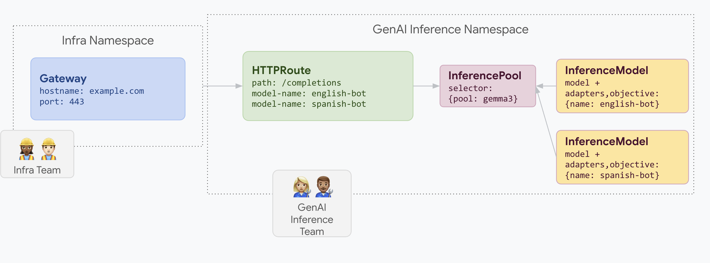

# Common Use Cases

??? example "Experimental"

    This project is still in an alpha state and breaking changes may occur in the future.

This section provides examples to address various generative AI application scenarios by using Gateway API Inference Extension.

## Example 1: Serve multiple generative AI models
A company wants to deploy multiple large language models (LLMs) to serve different workloads. 
For example, they might want to deploy a Gemma3 model for a chatbot interface and a Deepseek model for a recommendation application. 
The company needs to ensure optimal serving performance for these LLMs.
Using Gateway API Inference Extension, you can deploy these LLMs on your cluster with your chosen accelerator configuration in an `InferencePool`. 
You can then route requests based on the model name (such as chatbot and recommender) and the `Criticality` property.

The following diagram illustrates how Gateway API Inference Extension routes requests to different models based on the model name.


This example illustrates a conceptual example regarding how you can use the `HTTPRoute` object to route based on model name like “chatbot” or “recommender” to `InferencePool`.
```shell
apiVersion: gateway.networking.k8s.io/v1
kind: HTTPRoute
metadata:
  name: routes-to-llms
spec:
  parentRefs:
  - name: inference-gateway
  rules:
  - matches:
    - headers:
      - type: Exact
        name: X-Gateway-Model-Name
        value: chatbot
      path:
        type: PathPrefix
        value: /
    backendRefs:
    - name: gemma3
      kind: InferencePool
  - matches:
    - headers:
      - type: Exact
        name: X-Gateway-Model-Name
        value: recommender
      path:
        type: PathPrefix
        value: /
    backendRefs:
    - name: deepseek-r1
      kind: InferencePool
      
```


## Example 2:   Serve LoRA adapters on a shared accelerator
A company wants to serve LLMs for document analysis and focuses on audiences in multiple languages, such as English and Spanish. 
They have fine-tuned models for each language, but need to efficiently use their GPU and TPU capacity. 
You can use Gateway API Inference Extension to deploy dynamic LoRA fine-tuned adapters for each language (for example, `english-bot` and `spanish-bot`) on a common base model and accelerator. 
This lets you reduce the number of required accelerators by densely packing multiple models on a common accelerator.

The following diagram illustrates how Gateway API Inference Extension serves multiple LoRA adapters on a shared accelerator.

This example illustrates a conceptual example regarding how you can densely serve multiple LoRA adapters with distinct workload performance objectives on a common InferencePool.
Assuming we have created container pods with our base model and model server named “gemma2b-vllm”. We instantiate an `InferencePool` resource to logically represent all the container pods that are running this base model across all the nodes in our Kubernetes cluster.
```shell
apiVersion: gateway.networking.x-k8s.io/v1alpha1
kind: InferencePool
metadata:
  name: gemma3
  modelServerSelector:
  - pool: gemma3

```
Let us say we have a couple of LoRA adapters named “english-bot” and “spanish-bot” for the Gemma3 base model. 
You can create an `InferenceModel` resource and associate these LoRA adapters to the relevant InferencePool resource.  
In this case, we associate these LoRA adapters to the “gemma3 InferencePool resource created above.

```shell
apiVersion: inference.networking.x-k8s.io/v1alpha2
kind: InferenceModel
metadata:
  name: english-bot
spec:
  modelName: google/gemma-3-4b-it
  criticality: Standard
  poolRef:
    name: gemma3
        
---
apiVersion: inference.networking.x-k8s.io/v1alpha2
kind: InferenceModel
metadata:
  name: spanish-bot
spec:
  modelName: google/gemma-3-4b-it
  criticality: Critical
  poolRef:
    name: gemma3
    
```
Now, you can route your requests from the gateway using the `HTTPRoute` object.
```shell
apiVersion: gateway.networking.k8s.io/v1
kind: Gateway
metadata:
  name: inference-gateway
spec:
  listeners:
  - protocol: HTTP
    port: 80
    name: http

---
kind: HTTPRoute
apiVersion: gateway.networking.k8s.io/v1
metadata:
  name: routes-to-llms
spec:
  parentRefs:
    - name: inference-gateway
  rules:
  - matches:
      path:
        type: PathPrefix
        value: /
    backendRefs:
    - name: gemma3
      kind: InferencePool

```